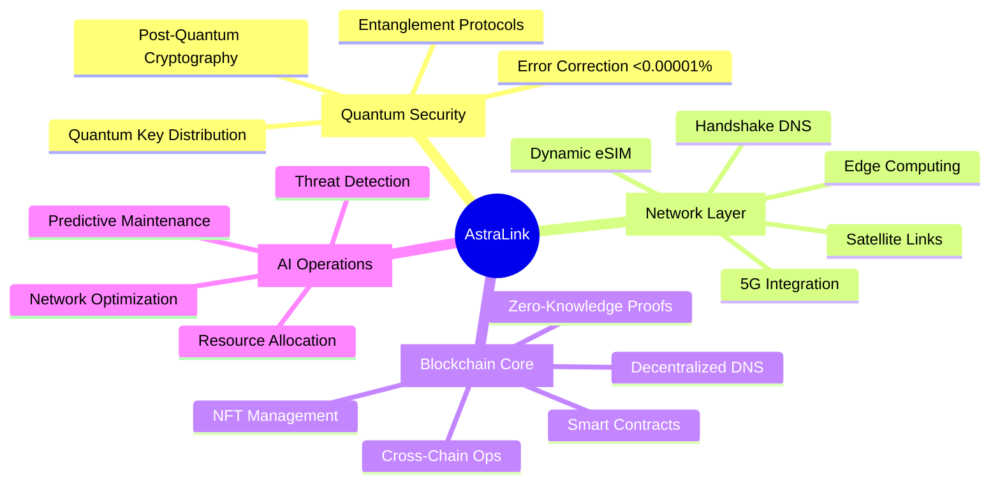
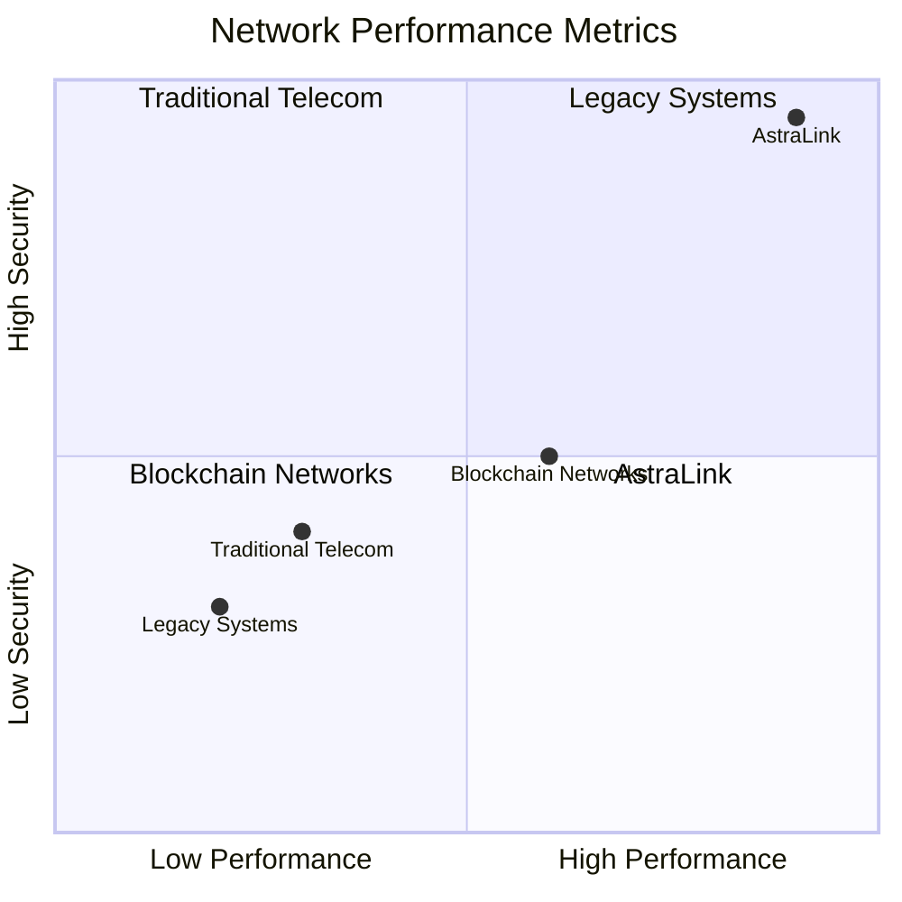

# AstraLink: Quantum-Powered Telecom Revolution

[](https://github.com/redx94/AstraLink/stargazers)
[](https://github.com/redx94/AstraLink/actions/workflows/build-and-push.yml)
[](docs/security_guide.md)
[](docs/)

> "The Future of Telecommunications is Here"

## 🌌 Quantum State Overview



## 🚀 Performance Matrix

| Component | Metric | Achievement |
|-----------|--------|-------------|
| Transactions | Throughput | 10,000+ TPS |
| Quantum Keys | Generation | 1M keys/sec |
| Network | Latency | <10ms |
| Availability | Uptime | 99.999% |
| AI Decisions | Response | <100ms |

## 🌐 Dimensional Navigation

Choose your entry point into the AstraLink universe:

### 🔮 Quantum Realm
- [Quantum Integration](docs/QuantumIntegration.md) - Harness quantum supremacy
- [Security Architecture](docs/security_guide.md) - Post-quantum security
- [Error Correction](docs/quantum_networking.md) - Surface code implementation

### 🌍 Physical Realm
- [Network Architecture](docs/ARCHITECTURE.md) - System design
- [Deployment Guide](docs/deployment_guide.md) - Infrastructure setup
- [Performance Optimization](docs/best_practices.md) - System tuning
- [Handshake Integration](docs/handshake_guide.md) - Decentralized DNS setup

### 💫 Development Realm
- [Developer Portal](docs/developer_guide.md) - Build on AstraLink
- [API Reference](docs/api_reference.md) - Interface specifications
- [SDK Guide](docs/sdk_reference.md) - Development toolkit

## 🛸 Quick Transport

```bash
# Clone the quantum realm
git clone https://github.com/redx94/AstraLink.git

# Initialize your quantum state
cd AstraLink
npm install
pip install -r requirements.txt

# Launch your node with Handshake DNS support
docker-compose up -d
```

## 🌌 Core Innovations

- **Quantum-Secured Communications**: Post-quantum cryptography with Kyber-1024 and Dilithium-5
- **Dynamic eSIM Management**: Blockchain-based, quantum-protected profile provisioning
- **AI Network Optimization**: Real-time resource allocation and predictive maintenance
- **Cross-Chain Interoperability**: Seamless blockchain integration and asset management
- **Decentralized DNS Infrastructure**: Handshake-powered domain (.quantum.api) with DNSSEC
- **Regulatory Compliance**: Built-in frameworks for GDPR, HIPAA, ISO27001, and more

## 🎯 Status Dashboard



## 🌐 Network Infrastructure

AstraLink leverages the Handshake naming system for truly decentralized DNS resolution. Our network operates on the `quantum.api` domain, providing:

- **Decentralized Authority**: No central certificate authorities
- **DNSSEC Integration**: Quantum-safe DNS security
- **Service Discovery**: Automatic node and service resolution
- **High Availability**: Distributed DNS infrastructure
- **Quantum-Safe Records**: Post-quantum cryptographic signatures

Access our services through our Handshake domain:
- API Gateway: `api.quantum.api`
- RPC Endpoint: `rpc.quantum.api`
- Developer Portal: `dev.quantum.api`
- Status Dashboard: `status.quantum.api`

## 🤝 Join the Revolution

- [Discord Community](https://discord.gg/astralink)
- [Developer Forum](https://forum.astralink.com)
- [Contributing Guide](CONTRIBUTING.md)
- [Research Papers](docs/research/)

## 📡 Enterprise Support

For enterprise-grade support and custom solutions:
- 🌟 24/7 Priority Support
- 🛡️ Custom Security Audits
- 🚀 Dedicated Engineering Team
- 📊 Performance Optimization
- 🔒 Custom Handshake Domain Integration

Contact: quantum.apii@gmail.com

## 📚 License

This project is proprietary software owned by AstraLink Technologies. Usage is subject to the AstraLink Proprietary License terms. See [LICENSE](LICENSE) for detailed terms and conditions.

**Note:** Enterprise licensing, support, and custom solutions are available. Contact quantum.apii@gmail.com for inquiries.
