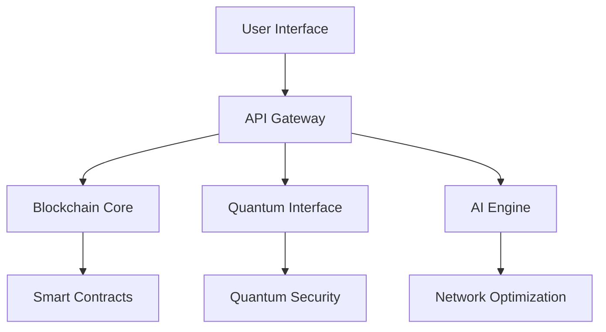

# AstraLink: Decentralized Blockchain Telecom Network

[](https://github.com/redx94/AstraLink/stargazers)  
[](https://github.com/redx94/AstraLink/actions/workflows/build-and-push.yml)


## Table of Contents
- [AstraLink: Decentralized Blockchain Telecom Network](#astralink-decentralized-blockchain-telecom-network)
  - [Table of Contents](#table-of-contents)
  - [Overview](#overview)
  - [Technical Specifications](#technical-specifications)
    - [Core Components](#core-components)
    - [Performance Metrics](#performance-metrics)
    - [System Requirements](#system-requirements)
      - [Minimum Hardware (Node Operation)](#minimum-hardware-node-operation)
      - [Recommended Hardware (Validator Node)](#recommended-hardware-validator-node)
  - [System Architecture](#system-architecture)
    - [Component Breakdown](#component-breakdown)
  - [Security Features](#security-features)
    - [Quantum Security Layer](#quantum-security-layer)
    - [Blockchain Security](#blockchain-security)
    - [Network Security](#network-security)
  - [Installation \& Setup](#installation--setup)
    - [Development Environment](#development-environment)
    - [Production Deployment](#production-deployment)
  - [Monitoring \& Maintenance](#monitoring--maintenance)
    - [Built-in Monitoring Tools](#built-in-monitoring-tools)
    - [Health Checks](#health-checks)
    - [Maintenance Procedures](#maintenance-procedures)
  - [Development Guide](#development-guide)
    - [Coding Standards](#coding-standards)
    - [Testing Framework](#testing-framework)
  - [Troubleshooting](#troubleshooting)
    - [Common Issues](#common-issues)
    - [Debugging Tools](#debugging-tools)
  - [Token Economics](#token-economics)
    - [BWT Token Utility](#bwt-token-utility)
    - [Token Distribution](#token-distribution)
    - [Staking Mechanics](#staking-mechanics)
  - [Contributing](#contributing)
    - [Development Process](#development-process)
    - [Code Requirements](#code-requirements)
  - [License](#license)
  - [Contact \& Support](#contact--support)
    - [Community Channels](#community-channels)
    - [Emergency Support](#emergency-support)

## Overview

AstraLink revolutionizes telecommunications through a decentralized network that combines blockchain technology, quantum computing, and artificial intelligence. Our platform delivers:

- **Decentralized Connectivity**: User-controlled cellular access through dynamic eSIM provisioning
- **Quantum-Secured Transactions**: Advanced encryption using quantum principles
- **AI-Powered Optimization**: Intelligent resource allocation and network management
- **Cross-Chain Operations**: Seamless interoperability across multiple blockchain networks
- **P2P Resource Sharing**: Democratized bandwidth marketplace with fair pricing

## Technical Specifications

### Core Components
- **Blockchain Protocol**: Ethereum-compatible with custom Layer 2 scaling
- **Smart Contract Runtime**: EVM-compatible, Solidity v0.8.x
- **Quantum Processing**: Integration with IBM Quantum services
- **AI Framework**: TensorFlow 2.x with custom quantum extensions
- **Network Protocol**: Modified 5G NSA with blockchain verification

### Performance Metrics
- Transaction Throughput: 10,000+ TPS
- Block Time: 2 seconds
- Quantum Key Generation: 1M keys/second
- AI Decision Latency: <100ms
- Network Availability: 99.999%

### System Requirements
#### Minimum Hardware (Node Operation)
- CPU: 8 cores, 3.0 GHz+
- RAM: 32GB DDR4
- Storage: 2TB NVMe SSD
- Network: 1Gbps symmetric connection
- GPU: NVIDIA RTX 3080 or equivalent (for AI operations)

#### Recommended Hardware (Validator Node)
- CPU: 16 cores, 3.5 GHz+
- RAM: 64GB DDR4
- Storage: 4TB NVMe SSD in RAID 1
- Network: 10Gbps symmetric connection
- GPU: NVIDIA RTX 4090 or equivalent

## System Architecture



### Component Breakdown
```
├── api/                    # RESTful API & GraphQL endpoints
│   ├── unified_api.py     # Main API controller
│   └── node_management.py # Node operations API
├── blockchain/            # Blockchain infrastructure
│   ├── contracts/        # Smart contract collection
│   └── network/         # Network protocols
├── quantum/             # Quantum computing modules
│   ├── controller/     # Quantum process management
│   └── security/      # Quantum encryption
├── ai/                # AI & ML systems
│   ├── forecasting/  # Network prediction
│   └── optimization/ # Resource allocation
└── network/         # Core network components
    ├── mesh/       # P2P networking
    └── carriers/  # Carrier integration
```

## Security Features

### Quantum Security Layer
- Quantum Key Distribution (QKD)
- Post-quantum cryptography
- Quantum random number generation
- Entanglement-based security protocols

### Blockchain Security
- Multi-signature validation
- Threshold cryptography
- Zero-knowledge proofs
- Automated smart contract auditing

### Network Security
- AI-powered threat detection
- Real-time anomaly detection
- Automated incident response
- Regular security assessments

## Installation & Setup

### Development Environment
```bash
# Clone repository
git clone https://github.com/redx94/AstraLink.git
cd AstraLink

# Install development tools
npm install -g hardhat typescript
pip install -r requirements.txt

# Configure environment
cp .env.example .env
# Edit .env with your configuration

# Start development services
docker-compose -f docker-compose.dev.yml up -d

# Deploy contracts to local network
npx hardhat compile
npx hardhat deploy --network localhost

# Start development server
npm run dev
```

### Production Deployment
```bash
# Build production images
docker-compose -f docker-compose.prod.yml build

# Configure production environment
vim config/production.yaml

# Deploy to production
docker-compose -f docker-compose.prod.yml up -d

# Monitor deployment
docker-compose logs -f
```

## Monitoring & Maintenance

### Built-in Monitoring Tools
- Prometheus metrics collection
- Grafana dashboards
- Log aggregation with ELK stack
- Performance analytics

### Health Checks
```bash
# Check system health
./tools/system_health_checker.py

# Monitor resource usage
./tools/resource_usage_tracker.py

# Security audit
./tools/security_audit_tool.py
```

### Maintenance Procedures
1. Regular backup scheduling
2. Node synchronization verification
3. Smart contract upgrades
4. Security patches deployment

## Development Guide

### Coding Standards
- TypeScript strict mode enabled
- Solidity style guide compliance
- Python PEP 8 standards
- Comprehensive unit testing

### Testing Framework
```bash
# Run unit tests
npm run test

# Run integration tests
python -m pytest test/integration_test.py

# Smart contract tests
npx hardhat test

# Coverage report
npm run coverage
```

## Troubleshooting

### Common Issues
1. **Node Synchronization Problems**
   - Check network connectivity
   - Verify blockchain sync status
   - Clear corrupted chain data

2. **Smart Contract Deployment Failures**
   - Verify gas settings
   - Check contract size
   - Validate dependencies

3. **Quantum Integration Issues**
   - Confirm quantum service availability
   - Check encryption parameters
   - Verify key distribution

### Debugging Tools
```bash
# Debug node connection
./tools/debugging_suite.py --check-connection

# Verify smart contracts
npx hardhat verify --network mainnet <contract-address>

# Test quantum connection
python quantum/quantum_controller.py --test-connection
```

## Token Economics

### BWT Token Utility
- Network access rights
- Governance participation
- Staking rewards
- Transaction fee payment

### Token Distribution
- Total Supply: 1,000,000,000 BWT
- Distribution:
  - Network Rewards: 45%
  - Ecosystem Development: 30%
  - Team & Advisors: 15%
  - Liquidity: 10%

### Staking Mechanics
- Minimum Stake: 10,000 BWT
- Lock Period: 30-365 days
- Annual Yield: 5-15%
- Slashing Conditions: Documented in [docs/staking_guide.md]

## Contributing

### Development Process
1. Fork repository
2. Create feature branch (`git checkout -b feature/improvement`)
3. Commit changes (`git commit -m 'Add feature'`)
4. Push to branch (`git push origin feature/improvement`)
5. Submit Pull Request

### Code Requirements
- 100% test coverage
- Documentation updates
- Performance benchmarks
- Security review
- Backwards compatibility

## License
This project is licensed under the [MIT License](LICENSE).

## Contact & Support

### Community Channels
- **Email**: quantum.apii@gmail.com
- **Discord**: [Join AstraLink Community](https://discord.gg/astralink)
- **GitHub Issues**: [Bug Reports & Features](https://github.com/redx94/AstraLink/issues)
- **Developer Documentation**: [GitHub Documentation](https://github.com/redx94/AstraLink/tree/main/docs)

### Emergency Support
- 24/7 Critical Issues: quantum.apii@gmail.com
