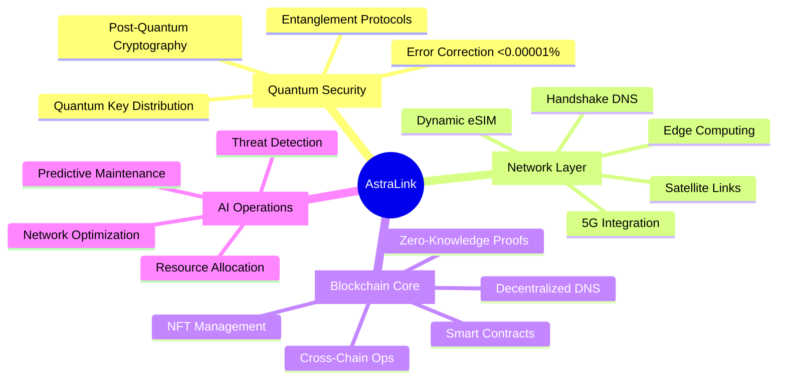
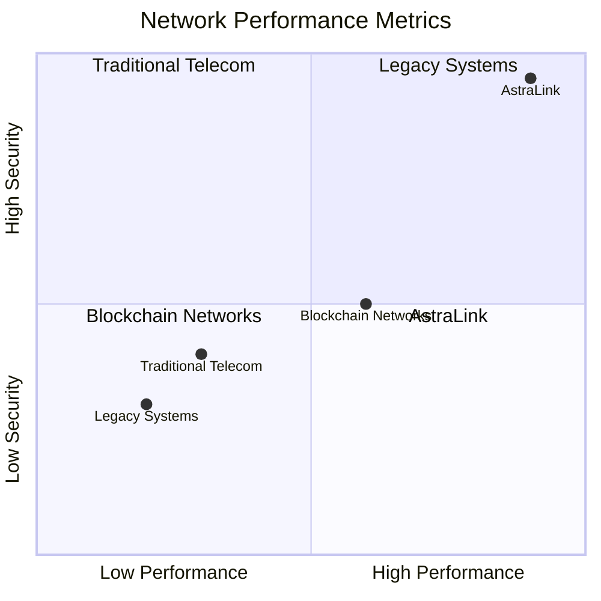

# AstraLink: Quantum-Powered Telecom Revolution

[](https://github.com/redx94/AstraLink/stargazers)
[](https://github.com/redx94/AstraLink/actions/workflows/build-and-push.yml)
[](docs/security_guide.md)
[](docs/)

> "The Future of Telecommunications is Here"

## 🌌 Quantum State Overview



## 🚀 Performance Matrix

| Component | Metric | Achievement |
|-----------|--------|-------------|
| Transactions | Throughput | 10,000+ TPS |
| Quantum Keys | Generation | 1M keys/sec |
| Network | Latency | <10ms |
| Availability | Uptime | 99.999% |
| AI Decisions | Response | <100ms |

## 🌐 Dimensional Navigation

Choose your entry point into the AstraLink universe:

### 🔮 Quantum Realm
- [Quantum Integration](docs/QuantumIntegration.md) - Harness quantum supremacy
- [Security Architecture](docs/security_guide.md) - Post-quantum security
- [Error Correction](docs/quantum_networking.md) - Surface code implementation

### 🌍 Physical Realm
- [Network Architecture](docs/ARCHITECTURE.md) - System design
- [Deployment Guide](docs/deployment_guide.md) - Infrastructure setup
- [Performance Optimization](docs/best_practices.md) - System tuning
- [Handshake Integration](docs/handshake_guide.md) - Decentralized DNS setup

### 💫 Development Realm
- [Developer Portal](docs/developer_guide.md) - Build on AstraLink
- [API Reference](docs/api_reference.md) - Interface specifications
- [SDK Guide](docs/sdk_reference.md) - Development toolkit

## 🛸 Quick Transport

```bash
# Clone the quantum realm
git clone https://github.com/redx94/AstraLink.git

# Initialize your quantum state
cd AstraLink
npm install
pip install -r requirements.txt

# Launch your node with Handshake DNS support
docker-compose up -d
```

## 🌌 Core Innovations

- **Quantum-Secured Communications**: Post-quantum cryptography with Kyber-1024 and Dilithium-5
- **Dynamic eSIM Management**: Blockchain-based, quantum-protected profile provisioning
- **AI Network Optimization**: Real-time resource allocation and predictive maintenance
- **Cross-Chain Interoperability**: Seamless blockchain integration and asset management
- **Decentralized DNS Infrastructure**: Handshake-powered domain (.quantum.api) with DNSSEC
- **Regulatory Compliance**: Built-in frameworks for GDPR, HIPAA, ISO27001, and more

## 🎯 Status Dashboard



## 🌐 Network Infrastructure

AstraLink leverages the Handshake naming system for truly decentralized DNS resolution. Our network operates on the `quantum.api` domain, providing:

- **Decentralized Authority**: No central certificate authorities
- **DNSSEC Integration**: Quantum-safe DNS security
- **Service Discovery**: Automatic node and service resolution
- **High Availability**: Distributed DNS infrastructure
- **Quantum-Safe Records**: Post-quantum cryptographic signatures

Access our services through our Handshake domain:
- API Gateway: `api.quantum.api`
- RPC Endpoint: `rpc.quantum.api`
- Developer Portal: `dev.quantum.api`
- Status Dashboard: `status.quantum.api`

## 🤝 Join the Revolution

- [Discord Community](https://discord.gg/astralink)
- [Developer Forum](https://forum.astralink.com)
- [Contributing Guide](CONTRIBUTING.md)
- [Research Papers](docs/research/)

## 📡 Enterprise Support

For enterprise-grade support and custom solutions:
- 🌟 24/7 Priority Support
- 🛡️ Custom Security Audits
- 🚀 Dedicated Engineering Team
- 📊 Performance Optimization
- 🔒 Custom Handshake Domain Integration

Contact: quantum.apii@gmail.com

## 📚 License

This project is proprietary software owned by AstraLink Technologies. Usage is subject to the AstraLink Proprietary License terms. See [LICENSE](LICENSE) for detailed terms and conditions.

**Note:** Enterprise licensing, support, and custom solutions are available. Contact quantum.apii@gmail.com for inquiries.

## NFT Functionality

### Introduction to NFT Functionality

The NFT functionality in AstraLink provides a secure and efficient way to manage digital assets, such as eSIM profiles, using blockchain technology. This feature integrates seamlessly with the AstraLink platform, offering enhanced security, ownership verification, and dynamic updates.

### Smart Contract Details

The NFT functionality is implemented using smart contracts, specifically `contracts/DynamicESIMNFT.sol` and `contracts/AstraLinkGenesisNFT.sol`. These contracts handle the creation, updating, and ownership management of NFTs.

### Minting NFTs

To mint an NFT, you need to follow these steps:

1. Call the `mintESIM` function in `contracts/DynamicESIMNFT.sol` or the `mintNFT` function in `contracts/AstraLinkGenesisNFT.sol`.
2. Provide the required parameters, such as the owner's address and the metadata for the NFT.
3. The smart contract will create a new NFT and assign it to the specified owner.

Example code snippet for minting an NFT:
```solidity
function mintESIM(uint256 _id, address _owner) public {
    require(esims[_id].id == 0, "ESIM already exists");
    esims[_id] = ESIM(_id, _owner, "Invalid", "");
}
```

### Relevant API Endpoints

The NFT functionality is integrated with the AstraLink API. For example, the `/v1/esim/create` endpoint in `api/unified_api.py` handles the creation of eSIMs, which are represented as NFTs.

### Updating NFT Status and Data

You can update the status and data of an NFT using the following functions in `contracts/DynamicESIMNFT.sol`:

- `updateStatus`: Updates the status of the NFT.
- `updateData`: Updates the data associated with the NFT.

Example code snippet for updating NFT status:
```solidity
function updateStatus(uint256 _id, address _owner, string memory _newStatus) public {
    require(esims[_id].owner == _owner, "Not the owner");
    esims[_id].status = _newStatus;
}
```

### Ownership Verification

To verify the ownership of an NFT, you can use the `verify_ownership` function in `blockchain/nft_manager.py`. This function ensures that only the rightful owner can perform certain actions on the NFT.

Example code snippet for verifying ownership:
```python
async def verify_ownership(self, token_id: int, user_address: str) -> bool:
    """Verify NFT ownership for eSIM validation"""
    try:
        owner = self.contract.functions.ownerOf(token_id).call()
        return owner.lower() == user_address.lower()
    except Exception as e:
        logger.error(f"Ownership verification failed: {str(e)}")
        raise NFTError(f"Ownership verification failed: {str(e)}")
```

### Examples and Visuals

Here are some examples and visuals to help you understand the NFT functionality better:

#### Example of an NFT Metadata
```json
{
  "esim_id": "1234567890",
  "carrier": "AstraLink",
  "activation_date": "2025-01-01",
  "plan_details": "Unlimited 5G"
}
```

#### Visual Representation of an NFT


### Usage Scenarios

The NFT functionality can be used in various scenarios within the AstraLink platform, such as:

- **Dynamic eSIM Provisioning**: Representing eSIM profiles as NFTs for secure and dynamic provisioning.
- **Ownership Verification**: Ensuring that only the rightful owner can manage the eSIM.
- **Bandwidth Allocation**: Representing bandwidth allocations as NFTs for trading and management.
- **Fundraising and Rewards**: Using NFTs for fundraising campaigns and rewarding top contributors.
- **Quantum Security**: Incorporating quantum security measures to ensure the integrity of the NFTs.
