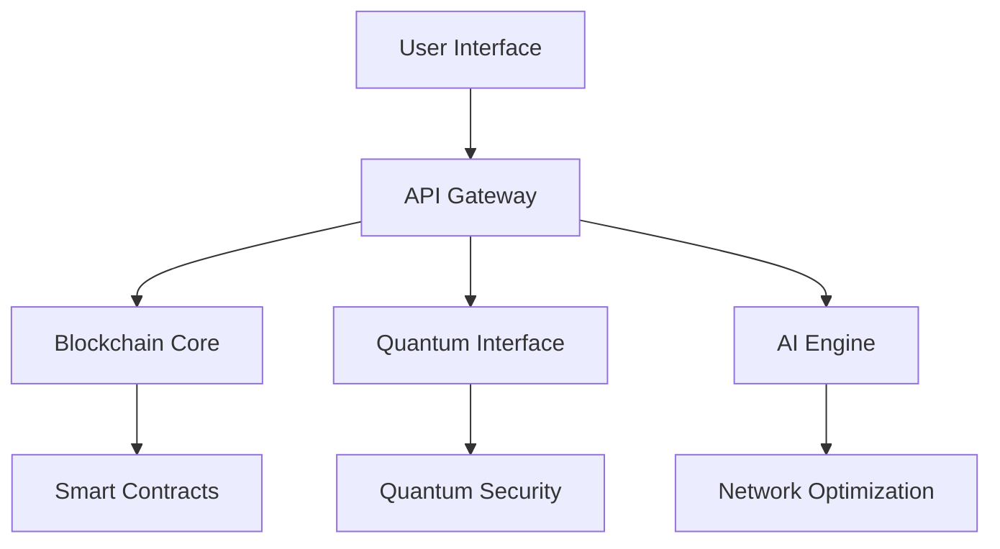

# AstraLink: Decentralized Blockchain Telecom Network

[](https://github.com/redx94/AstraLink/stargazers)  
[](https://github.com/redx94/AstraLink/actions/workflows/build-and-push.yml)


## Table of Contents
- [Overview](#overview)
- [Features](#features)
- [Technical Specifications](#technical-specifications)
- [System Architecture](#system-architecture)
- [Security Features](#security-features)
- [Installation & Setup](#installation--setup)
- [Documentation](#documentation)
- [Contributing](#contributing)
- [Support](#support)
- [License](#license)

## Overview

AstraLink revolutionizes telecommunications through a decentralized network that combines blockchain technology, quantum computing, and artificial intelligence. Our platform delivers unprecedented security, scalability, and efficiency in telecom services.

### Key Innovations
- Quantum-secured communications
- Decentralized eSIM management
- AI-driven network optimization
- Cross-chain interoperability
- Dynamic resource allocation

## Features

### Core Capabilities
- **Dynamic eSIM Provisioning**: Instant, secure eSIM deployment
- **Quantum Security**: Post-quantum cryptography and QKD
- **AI Optimization**: Real-time network resource management
- **Blockchain Integration**: Transparent, secure transactions
- **Cross-Chain Operations**: Multi-chain compatibility

### Advanced Features
- **Quantum Error Correction**: < 0.00001% error rate
- **AI Forecasting**: Predictive network management
- **Smart Contracts**: Automated service provisioning
- **Regulatory Compliance**: Built-in compliance frameworks
- **High Availability**: 99.999% uptime guarantee

## Technical Specifications

### Core Components
- **Blockchain Protocol**: Ethereum-compatible with Layer 2 scaling
- **Smart Contract Runtime**: EVM-compatible, Solidity v0.8.x
- **Quantum Processing**: IBM Quantum integration
- **AI Framework**: TensorFlow 2.x with quantum extensions
- **Network Protocol**: Modified 5G NSA with blockchain verification

### Performance Metrics
- Transaction Throughput: 10,000+ TPS
- Block Time: 2 seconds
- Quantum Key Generation: 1M keys/second
- AI Decision Latency: <100ms
- Network Availability: 99.999%

### System Requirements
#### Minimum Hardware (Node Operation)
- CPU: 8 cores, 3.0 GHz+
- RAM: 32GB DDR4
- Storage: 2TB NVMe SSD
- Network: 1Gbps symmetric connection
- GPU: NVIDIA RTX 3080 or equivalent (for AI operations)

#### Recommended Hardware (Validator Node)
- CPU: 16 cores, 3.5 GHz+
- RAM: 64GB DDR4
- Storage: 4TB NVMe SSD in RAID 1
- Network: 10Gbps symmetric connection
- GPU: NVIDIA RTX 4090 or equivalent

## System Architecture



### Component Breakdown
```
├── api/                    # RESTful API & GraphQL endpoints
│   ├── unified_api.py     # Main API controller
│   └── node_management.py # Node operations API
├── blockchain/            # Blockchain infrastructure
│   ├── contracts/        # Smart contract collection
│   └── network/         # Network protocols
├── quantum/             # Quantum computing modules
│   ├── controller/     # Quantum process management
│   └── security/      # Quantum encryption
├── ai/                # AI & ML systems
│   ├── forecasting/  # Network prediction
│   └── optimization/ # Resource allocation
└── network/         # Core network components
    ├── mesh/       # P2P networking
    └── carriers/  # Carrier integration
```

## Security Features

### Quantum Security Layer
- Quantum Key Distribution (QKD)
- Post-quantum cryptography
- Quantum random number generation
- Entanglement-based security protocols

### Blockchain Security
- Multi-signature validation
- Threshold cryptography
- Zero-knowledge proofs
- Automated smart contract auditing

### Network Security
- AI-powered threat detection
- Real-time anomaly detection
- Automated incident response
- Regular security assessments

## Installation & Setup

### Quick Start
```bash
# Clone repository
git clone https://github.com/redx94/AstraLink.git
cd AstraLink

# Install dependencies
npm install
pip install -r requirements.txt

# Configure environment
cp .env.example .env

# Start development environment
docker-compose up -d
```

For detailed setup instructions, see our [Installation Guide](docs/deployment_guide.md).

## Documentation

### Developer Resources
- [Developer Guide](docs/developer_guide.md)
- [API Reference](docs/api_reference.md)
- [Quantum Integration](docs/QuantumIntegration.md)
- [Security Guide](docs/security_guide.md)
- [Testing Guide](docs/integration_testing_guide.md)

### User Resources
- [User Guide](docs/user_guide.md)
- [Troubleshooting](docs/troubleshooting.md)
- [FAQs](docs/faqs.md)
- [Best Practices](docs/best_practices.md)

## Contributing

We welcome contributions! Please see our [Contributing Guidelines](CONTRIBUTING.md) for details on:
- Code standards
- Development workflow
- Review process
- Testing requirements

## Support

### Community Channels
- Email: quantum.apii@gmail.com
- Discord: [AstraLink Community](https://discord.gg/astralink)
- GitHub Issues: [Bug Reports & Features](https://github.com/redx94/AstraLink/issues)
- Documentation: [GitHub Documentation](docs/)

### Emergency Support
For critical issues requiring immediate attention:
- 24/7 Support: quantum.apii@gmail.com
- Emergency Hotline: Available to enterprise customers

## License

This project is licensed under the [MIT License](LICENSE). See the LICENSE file for details.
