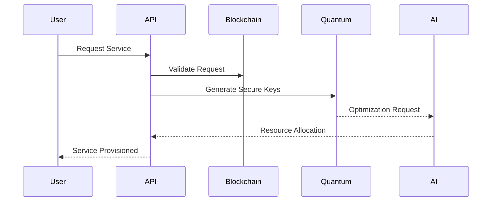

# AstraLink System Architecture

## Overview

AstraLink is built on a multi-layer architecture that combines blockchain technology, quantum computing, and artificial intelligence to create a revolutionary telecom network infrastructure.

## System Components

### 1. Blockchain Layer
- **Smart Contracts (Solidity)**
  - Dynamic eSIM NFT management
  - Bandwidth marketplace contracts
  - Cross-chain bridge implementation
  - Zero-knowledge proof verification

- **Network Consensus**
  - Proof-of-Stake mechanism
  - Validator node requirements
  - Block production and validation
  - Network security measures

- **Token Economics**
  - BWT token utility
  - Staking mechanisms
  - Reward distribution
  - Network incentives

### 2. AI Layer
- **Multiversal Forecasting**
  - Network load prediction
  - Resource optimization
  - Traffic pattern analysis
  - Automated scaling

- **Quantum Integration**
  - Quantum state management
  - Error correction
  - Quantum key distribution
  - Entanglement protocols

- **Security Operations**
  - Threat detection
  - Anomaly identification
  - Automated response systems
  - Security audit automation

### 3. Network Layer
- **eSIM Management**
  - Dynamic provisioning
  - Profile management
  - Carrier integration
  - Access control

- **Resource Allocation**
  - Bandwidth distribution
  - QoS management
  - Load balancing
  - Failover handling

- **Infrastructure Management**
  - Node deployment
  - Network monitoring
  - Performance optimization
  - Maintenance automation

## Integration Points

### Component Communication
- **Event System**
  - Smart contract events
  - System state changes
  - Error notifications
  - Performance metrics

- **API Layer**
  - REST endpoints
  - GraphQL interface
  - WebSocket connections
  - gRPC services

### Data Flow

## Security Architecture

### Quantum Security Layer
- Post-quantum cryptography implementation
- Quantum key distribution protocols
- Entanglement-based security
- Quantum random number generation

### Traditional Security
- Multi-signature validation
- Role-based access control
- Audit logging
- Intrusion detection

## Scalability Features

### Horizontal Scaling
- Dynamic node addition
- Load distribution
- Cross-region deployment
- Performance optimization

### Vertical Scaling
- Resource allocation
- Hardware optimization
- Performance tuning
- Capacity planning

## Deployment Architecture

### Infrastructure Requirements
- Minimum hardware specifications
- Network requirements
- Storage considerations
- Security prerequisites

### High Availability
- Redundancy implementation
- Failover mechanisms
- Disaster recovery
- Backup strategies

## Monitoring and Maintenance

### System Monitoring
- Performance metrics
- Resource utilization
- Security events
- Network health

### Automated Maintenance
- System updates
- Security patches
- Performance optimization
- Data cleanup

## Future Expansions

### Planned Improvements
- Enhanced quantum integration
- AI capability expansion
- Cross-chain interoperability
- Performance optimizations
