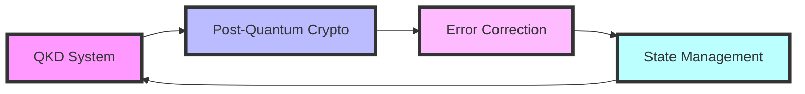
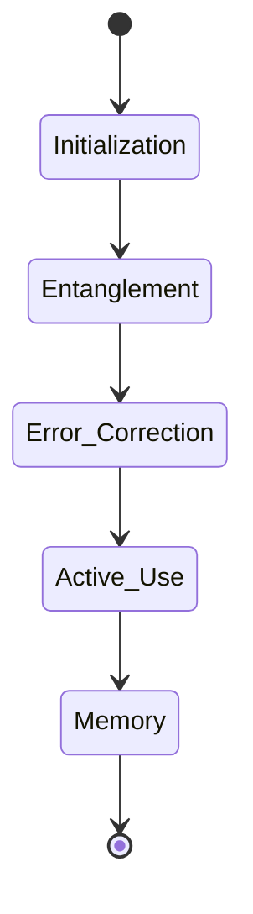
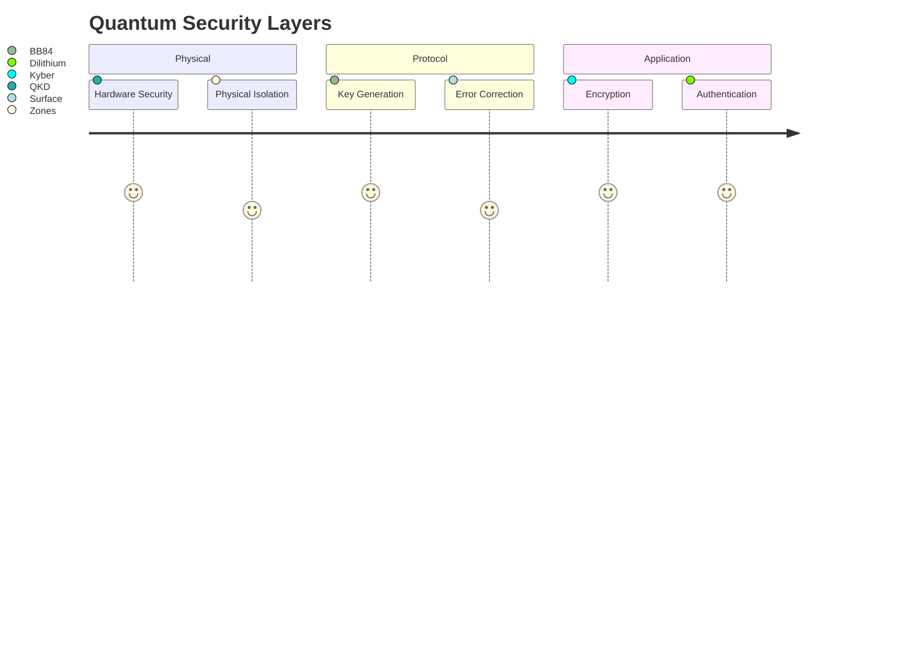
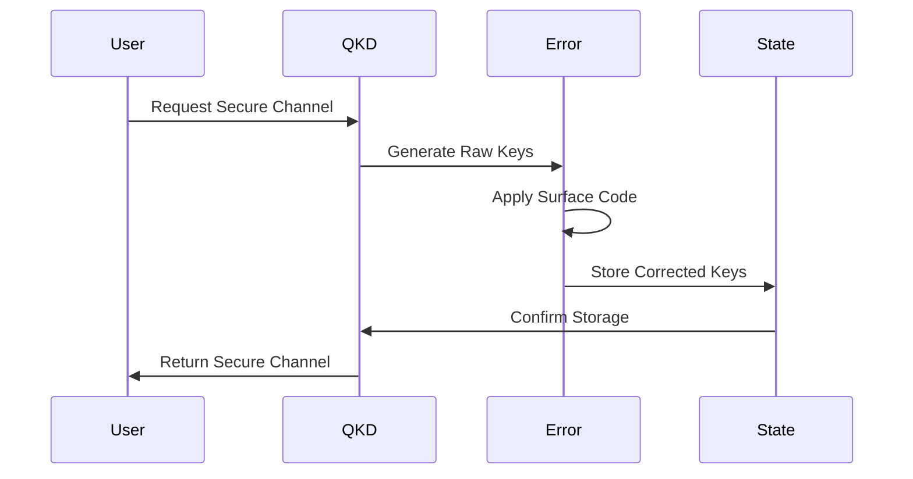

# Quantum Integration and Security Architecture

> "Where Classical Meets Quantum"

## 🌌 Core Quantum Features



### 1. Quantum Key Distribution (QKD)
- **Protocol**: BB84 with entanglement enhancement
- **Key Rate**: 1M keys/second
- **Security**: Information-theoretic security
- **Integration Points**:
  ```mermaid
  flowchart TD
      A[eSIM Provisioning] --> B[QKD System]
      C[Network Auth] --> B
      D[Smart Contracts] --> B
      E[Cross-Chain Bridges] --> B
      B --> F[Quantum Memory]
  ```

### 2. Post-Quantum Cryptography
- **Key Encapsulation**: Kyber-1024
- **Digital Signatures**: Dilithium-5
- **Hash Functions**: SPHINCS+
- **Zero-Knowledge**: zk-SNARKs

### 3. Quantum Error Correction
| Algorithm | Threshold | Recovery Time | Application |
|-----------|-----------|---------------|-------------|
| Surface Code | 0.01% | 1ms | Primary |
| Lattice Surgery | 0.001% | 5ms | High-Security |
| Magic State | 0.0001% | 10ms | Critical Data |

### 4. Quantum State Management


## 🔬 Implementation Guidelines

### Hardware Requirements Matrix
| Component | Minimum | Recommended | Enterprise |
|-----------|---------|-------------|------------|
| Qubits | 50 | 100 | 500+ |
| Coherence Time | 100μs | 500μs | >1ms |
| Gate Fidelity | 99.9% | 99.99% | 99.999% |
| Measurement | 99% | 99.9% | 99.99% |

### Network Integration
```typescript
interface QuantumConfig {
  errorThreshold: number;
  keyRate: number;
  algorithm: 'Kyber-1024' | 'Dilithium-5';
  backupStrategy: 'instant' | 'periodic';
}

class QuantumNetwork {
  private qkd: QKDSystem;
  private errorCorrection: ErrorCorrection;
  private stateManager: StateManager;

  async establishQuantumChannel(
    config: QuantumConfig
  ): Promise<QuantumChannel> {
    // Implementation details...
  }
}
```

## 🔐 Security Architecture

### Quantum Security Stack


### Monitoring Metrics
- **Key Performance**:
  - Generation Rate: >1M/s
  - Error Rate: <0.00001%
  - Entropy: >0.99
  - Latency: <1ms

## 🔄 Operational Flow



## 🚀 Performance Optimization

### Quantum Circuit Optimization
- Gate reduction techniques
- Parallel execution patterns
- Resource estimation
- Noise mitigation strategies

### Classical-Quantum Integration
- Load balancing algorithms
- Resource scheduling
- Priority queuing
- Failover protocols

## 📈 Future Roadmap

### Short-term Goals (6 months)
- [ ] Increase key generation rate to 2M/s
- [ ] Reduce error rate to 0.000001%
- [ ] Implement multi-party quantum protocols
- [ ] Enhance cross-platform integration

### Long-term Vision (2+ years)
- [ ] Quantum supremacy demonstrations
- [ ] Advanced error correction codes
- [ ] Quantum internet protocols
- [ ] Global quantum network

## 🤝 Support Resources

### Documentation
- [Quantum Protocol Specs](quantum_protocols.md)
- [Integration Guide](integration_guide.md)
- [Security Guidelines](security_guide.md)
- [Operational Procedures](operations_guide.md)

### Development Tools
- Quantum Simulators
- Testing Frameworks
- Monitoring Systems
- Analysis Tools

### Community Resources
- [Research Papers](research/)
- [Technical Forums](https://forum.astralink.com)
- [Developer Resources](https://dev.astralink.com)
- [Example Implementations](examples/)
