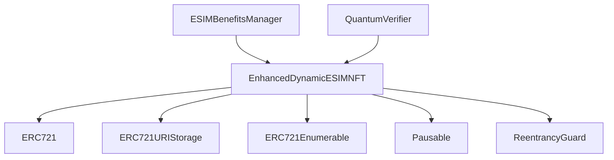

# AstraLink eSIM NFT System

## Overview
The AstraLink eSIM NFT system represents a revolutionary approach to eSIM management, combining practical utility with collectible digital art. Each eSIM is represented as a unique NFT with varying rarity levels, visual themes, and special benefits.

## Features

### 1. NFT Characteristics

#### Rarity Tiers
- **Legendary** (950-1000 points)
  - 5x benefit multiplier
  - Highest priority in network routing
  - Exclusive quantum encryption access
  
- **Epic** (850-949 points)
  - 3x benefit multiplier
  - Enhanced network priority
  - Premium data features
  
- **Rare** (700-849 points)
  - 2x benefit multiplier
  - Improved network features
  
- **Common** (1-699 points)
  - Base level benefits
  - Standard network access

#### Visual Themes
Each eSIM NFT features unique artwork generated based on its theme:

1. **Quantum Theme**
   - Quantum noise patterns
   - Vibrant quantum color schemes
   - Entanglement-inspired visuals
   ```
   Benefits:
   - 50% speed boost (before rarity multiplier)
   - Priority routing
   - Data rollover
   - Peak hour priority
   - Quantum encryption access
   ```

2. **Cosmic Theme**
   - Deep space imagery
   - Nebula-inspired patterns
   - Celestial body elements
   ```
   Benefits:
   - 30% speed boost (before rarity multiplier)
   - Priority routing
   - Data rollover
   ```

3. **Cyber Theme**
   - Cyberpunk aesthetics
   - Neon grid patterns
   - Digital rain effects
   ```
   Benefits:
   - 40% speed boost (before rarity multiplier)
   - Priority routing
   - Peak hour priority
   ```

4. **Nebula Theme**
   - Soft, ethereal patterns
   - Pastel color schemes
   - Cosmic dust effects
   ```
   Benefits:
   - 20% speed boost (before rarity multiplier)
   - Data rollover
   ```

5. **Matrix Theme**
   - Digital rain patterns
   - Matrix-style code elements
   - Green-tinted cybersecurity themes
   ```
   Benefits:
   - 25% speed boost (before rarity multiplier)
   - Priority routing
   - Quantum encryption access
   ```

### 2. Technical Features

#### QR Code Activation
Each eSIM NFT includes a secure QR code for easy device activation:
```
QR Code Format:
{
  "type": "eSIM",
  "carrier": "AstraLink Global",
  "activationCode": "LPA:1$...",
  "tokenId": "...",
  "bandwidth": "..."
}
```

#### Quantum Security
- Quantum signature verification
- Entanglement-based security features
- Post-quantum cryptography

#### Smart Contract Architecture


### 3. Marketplace Features

#### Trading System
- List eSIMs for sale
- Transfer ownership while maintaining benefits
- Built-in marketplace fee system (2.5%)
- Automatic benefits transfer to new owner

#### Value Factors
1. Rarity Score (1-1000)
2. Theme Uniqueness
3. Benefit Package
4. Historical Usage
5. Network Performance

### 4. Benefits System

#### Base Benefits
All eSIM NFTs include:
- Basic network access
- Standard data allocation
- QR code activation
- Quantum security

#### Enhanced Benefits
Based on rarity and theme:
- Speed multipliers (up to 5x)
- Priority routing
- Data rollover
- Peak hour priority
- Quantum encryption access
- Bonus points system

#### Bonus Points System
- Points earned based on data usage
- Rarity-based point multipliers
- Redeemable for extra benefits
- Transferable with NFT

## Visual Examples

### Example NFT Artworks

```
Note: These are example representations. Actual NFTs are generated dynamically.

Legendary Quantum Theme:
┌────────────────────┐
│    ⚛️ 🌌 ✨       │
│  🔮   AstraLink    │
│    Quantum eSIM    │
│ Legendary #001     │
│     ⚡️ 💫 ⚛️      │
└────────────────────┘

Epic Cyber Theme:
┌────────────────────┐
│    🌐 💻 ⚡️       │
│  🔒   AstraLink    │
│    Cyber eSIM      │
│   Epic #002        │
│     💫 🌐 🔮      │
└────────────────────┘
```

### QR Code Example
```
┌───────────────────────┐
│ █▀▀▀▀▀█ █  █ █▀▀▀▀▀█ │
│ █ ███ █ █  █ █ ███ █ │
│ █ ▀▀▀ █ █  █ █ ▀▀▀ █ │
│ ▀▀▀▀▀▀▀▀▄▄▄▀▀▀▀▀▀▀▀▀ │
│ AstraLink eSIM       │
└───────────────────────┘
```

## Implementation Examples

### Minting an eSIM NFT
```javascript
// Example minting process
const esimNFT = await ESIMNFT.deploy();
const qSignature = await verifier.generateQuantumChallenge(userAddress);
const validityPeriod = 365 * 24 * 60 * 60; // 1 year

await esimNFT.mintESIM(
    userAddress,
    tokenId,
    bandwidth,
    qSignature,
    carrierData,
    validityPeriod,
    qrHash
);
```

### Checking Benefits
```javascript
const benefits = await benefitsManager.calculateBenefits(tokenId);
console.log(`Speed Boost: ${benefits.speedMultiplier}x`);
console.log(`Priority Routing: ${benefits.hasPriorityRouting}`);
console.log(`Data Rollover: ${benefits.hasDataRollover}`);
```

## User Guide

### 1. Acquiring an eSIM NFT
1. Purchase through AstraLink platform
2. Select desired bandwidth package
3. Receive NFT with random rarity and theme
4. Access QR code for activation

### 2. Activating Your eSIM
1. Open device settings
2. Scan NFT's QR code
3. Follow carrier activation process
4. Verify quantum signature

### 3. Managing Benefits
1. Check your NFT's rarity and theme
2. View available benefits
3. Monitor bonus points
4. Redeem additional benefits

### 4. Trading eSIMs
1. List NFT on marketplace
2. Set desired price
3. Transfer includes all benefits
4. Maintain service during transfer

## Technical Integration

### API Integration
```typescript
// Example API call to mint new eSIM NFT
const response = await api.post('/v1/esim/mint', {
    user: userAddress,
    bandwidth: 100,
    validityPeriod: 31536000 // 1 year
});

// Example benefits calculation
const benefits = await api.get(`/v1/esim/benefits/${tokenId}`);
```

### Smart Contract Events
```solidity
event ESIMMinted(uint256 indexed tokenId, address indexed owner, uint256 bandwidth, uint256 rarity);
event ESIMActivated(uint256 indexed tokenId, uint256 activationTime);
event ESIMBandwidthUpdated(uint256 indexed tokenId, uint256 newBandwidth);
event BonusPointsEarned(uint256 indexed tokenId, uint256 points);
```

## Security Considerations

### Quantum Security
- Post-quantum cryptography implementation
- Quantum signature verification
- Entanglement-based security

### Smart Contract Security
- Reentrancy protection
- Access control
- Pausable functionality
- Quantum-safe upgrades

### Data Privacy
- Encrypted carrier data
- Private metadata storage
- Quantum-resistant encryption

## Future Developments

### Planned Features
1. Additional themes and artwork styles
2. Enhanced benefit packages
3. Cross-chain compatibility
4. Advanced trading features
5. Improved quantum security

### Roadmap
- Q2 2025: Layer 2 integration
- Q3 2025: Cross-chain bridging
- Q4 2025: Advanced quantum features
- Q1 2026: Enhanced marketplace